# Documentacion MarkDowns

Lo primero que tenemos que hacer para crear un repositorio es crear la carpeta

una vez creada la carpeta, con el comando **git init**

dentro de la carpeta, habremos iniciado el repositorio. Esto lo sabremos porque al lado de la ruta donde estamos aparecea un texto en azul que nos indica que estamos en la rama principal

**(master)**

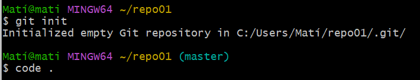

Despues de esto con el comando **Code .** lo que estamos haciendo es abrir la aplicacion de VisualStudio code, con la terminal usando **Ctrl + ñ** agregaremos el fichero readme.md para ganerar la documentacion 

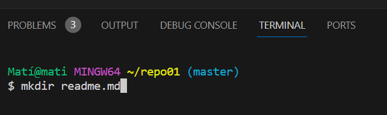

si hacemos un **git status** podremos ver en que estado se encuentra el archivo actulmente

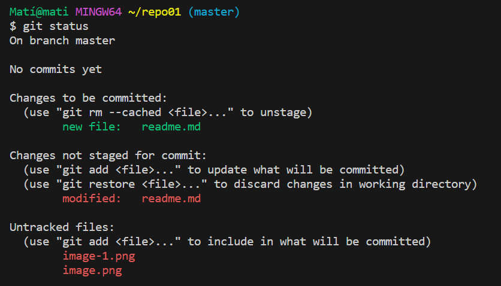

de aqui podemos sacar bastate informacion 

- **On branch master:**
  esto nos esta indicando en la ubicacion en la que nos encontramos en caso de tener diferentes ramas en el main.

- **No commits yet:**
  no esta indicando que aun no se han realizado commits con los cambios que se han hecho

- **Changes to be committed:**
  en este caso es porque previamente se ha hecho un **gir add readme.md** pero no se ha heho un comit, por lo que esta pendiente

- **hanges not staged for commit:** esto nos aparece porque el archivo ha sido modificado y no se ha hecho un **git add**
  
- **Untracked files:** es para clasificar los archivos que se han agregado a la carpeta local del repositorio pero no se han agregado, no estan reconocidos por lo que habria que hacer un **git add (./ < nombre del fichero >)

Ahora intentaremos hacer un push pero no se nos permite

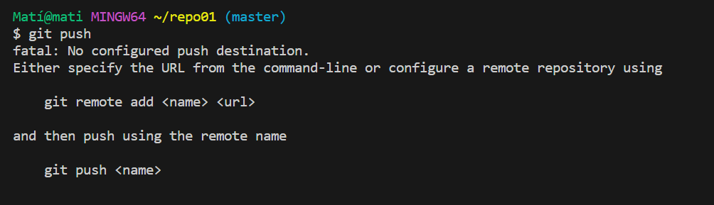

Esto se debe a que nuestro repositorio se encuentra en **Local** y no tiene acceso a la o no se ha creado uno en **remoto**. Para ello tendremos que creear uno desde

- [Github](http://www.github.com)
  
- [GitLab](http://www.gitlab.com)
  
- [BitDocker](https://bitbucket.org/)

En este caso usaremos **GitHub**.

Creareemos un repositorio publico

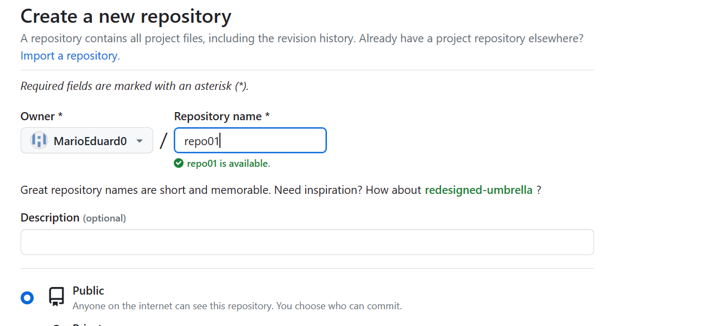

Ya tenemos nuestro repositorio en **Github** ahora lo que haremos es a nuestro repositorio **Local** le asiganremos la ruta en **remoto**. Para ello tenemos 2 casos 

1. No tenemos un repositorio: 
   En este caso es cuando no hemos creado el repositorio en local y **github** nos enseña brevemente como hacerlo

   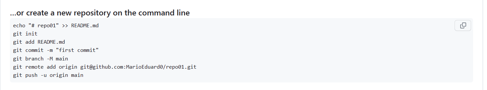

2. Si ya contamos con el repositorio en local creado simplemente le agregamos la ruta
   
   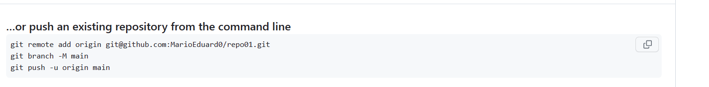

3. la ultima opcion es para importar un repositorio de otra parte usando un codigo
   
   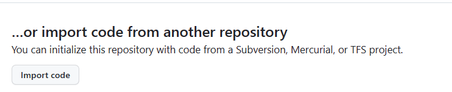

## Push

Una vez tengamos el repositorio **local** vinculado al **remoto** podremos hacer el push desde terminal

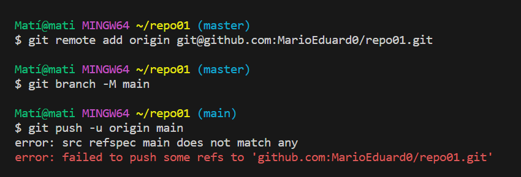

En la imagen hay un error porque si hacemos un **git status**, vemos que hay cambios que no se han **commiteado** y hay archivos que no siguen con el estado **untracked**

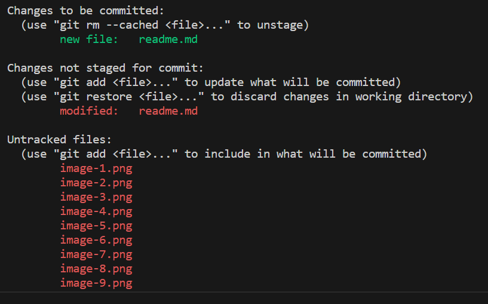

simplemente agregamos los ficheros y hacemos **commit**

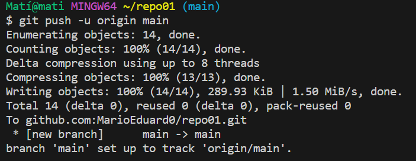

y con estro habriamos hecho un push correctamente, si volveoms a **GitHub** veremos todos los archivos actualizados 

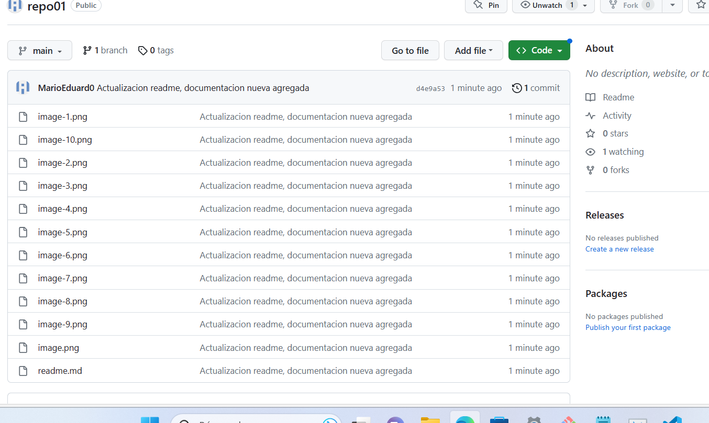

- Git remtoe -v:
  
  Si Ejecutamos este comando previamente a la conexion con el **repositorio remoto** no nos aparecera nada, ya que no tendremos la **url**  asociada a nuestro **repositorio local**

  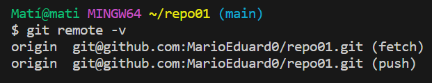
 *"Imagen de la terminal despues de hacer la conexion remota"*